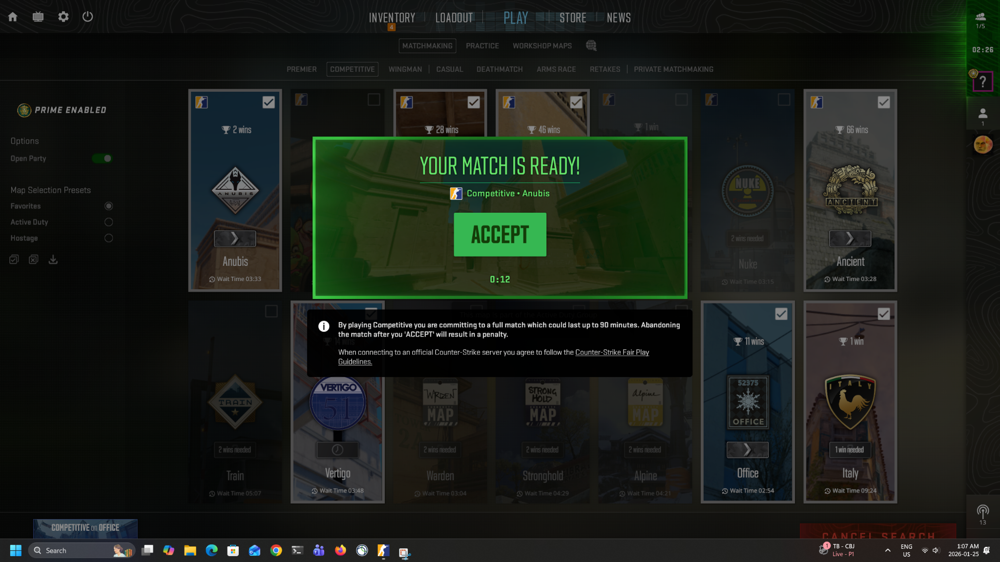

# CS2 Auto Accept



**Automatically accept Counter-Strike 2 competitive matchmaking.** Never miss a match or get kicked for not accepting in time!

## 📋 Features

- 🎯 **Automatic Detection** - Uses OpenCV image recognition to detect the accept button
- ⚡ **Fast Response** - Scans screen every 5 seconds for instant acceptance
- 🖱️ **One-Click Operation** - Simple Start/Stop interface
- 💻 **Lightweight** - Minimal system resource usage
- 🔒 **Safe** - No game file modifications, works externally

## 🚀 Quick Start

### Prerequisites

- Java 17 or higher
- Counter-Strike 2 installed
- Windows or Linux operating system

### Running the Application

Download the latest executable for your platform from the [Releases](https://github.com/waseertanvir/AutoAccept/releases) page.

**Windows:**
- Download `CS2AutoAccept.exe`
- Double-click to run

**Linux:**
- Download `CS2AutoAccept` (or `.deb`/`.rpm` package)
- Run: `./CS2AutoAccept`
- Or install the package: `sudo dpkg -i CS2AutoAccept.deb`

## 📖 How to Use

1. **Launch the application** - Run the JAR file or executable
2. **Start CS2** - Queue for competitive matchmaking as normal
3. **Click "Start"** - Enable auto-accept monitoring
4. **Play your game** - The tool will automatically click accept when a match is found
5. **Click "Stop"** - Disable monitoring when done

## 🔧 Configuration

### Setting Up Your Accept Button Image

The tool needs a screenshot of the CS2 accept button to work:

1. When CS2 shows the accept dialog, take a screenshot
2. Crop just the accept button
3. Save it as `cs2_accept_button.png`
4. Place it in `src/main/resources/` folder

### Adjusting Detection Sensitivity

Edit the `MATCH_THRESHOLD` value in the code (default: 0.8):
- **Higher values (0.9-1.0)** - More strict matching, fewer false positives
- **Lower values (0.6-0.8)** - More lenient matching, may click wrong buttons

## 🛠️ Building from Source

### Requirements
- Java 17+
- Maven 3.6+

### Build Steps

```bash
# Clone the repository
git clone https://github.com/yourusername/cs2-auto-accept.git
cd cs2-auto-accept

# Build with Maven
mvn clean package

# Run the application
java -jar target/cs2-auto-accept-1.0.jar
```

### Dependencies

- OpenCV 4.9.0 (via org.openpnp)
- Java Swing (built-in)
- Java AWT Robot (built-in)

## ⚙️ How It Works

1. **Screen Capture** - Takes a screenshot every 5 seconds
2. **Template Matching** - Uses OpenCV to search for the accept button image
3. **Auto Click** - When button is detected, automatically moves mouse and clicks
4. **Continuous Monitoring** - Repeats until stopped by user

## 🐛 Troubleshooting

**Button not being detected:**
- Ensure your `cs2_accept_button.png` is a clear, exact screenshot of the button
- Try adjusting the `MATCH_THRESHOLD` value
- Check that CS2 is running in windowed or borderless mode

**Application won't start:**
- Verify Java 17+ is installed: `java -version`
- Check that all dependencies are included
- Ensure OpenCV natives are properly loaded

**Clicks in wrong location:**
- Retake your accept button screenshot
- Ensure no other UI elements look similar to the accept button

## ⚠️ Disclaimer

This tool is for personal use only. Use at your own risk. The developers are not responsible for any consequences from using this software, including but not limited to account restrictions or bans.

## 📄 License

This project is licensed under the MIT License - see the [LICENSE](LICENSE) file for details.

## 🤝 Contributing

Contributions are welcome! Please feel free to submit a Pull Request.

1. Fork the repository
2. Create your feature branch (`git checkout -b feature/AmazingFeature`)
3. Commit your changes (`git commit -m 'Add some AmazingFeature'`)
4. Push to the branch (`git push origin feature/AmazingFeature`)
5. Open a Pull Request

## 📧 Support

If you encounter any issues or have questions:
- Open an [Issue](https://github.com/waseertanvir/AutoAccept/issues)
- Check existing issues for solutions
